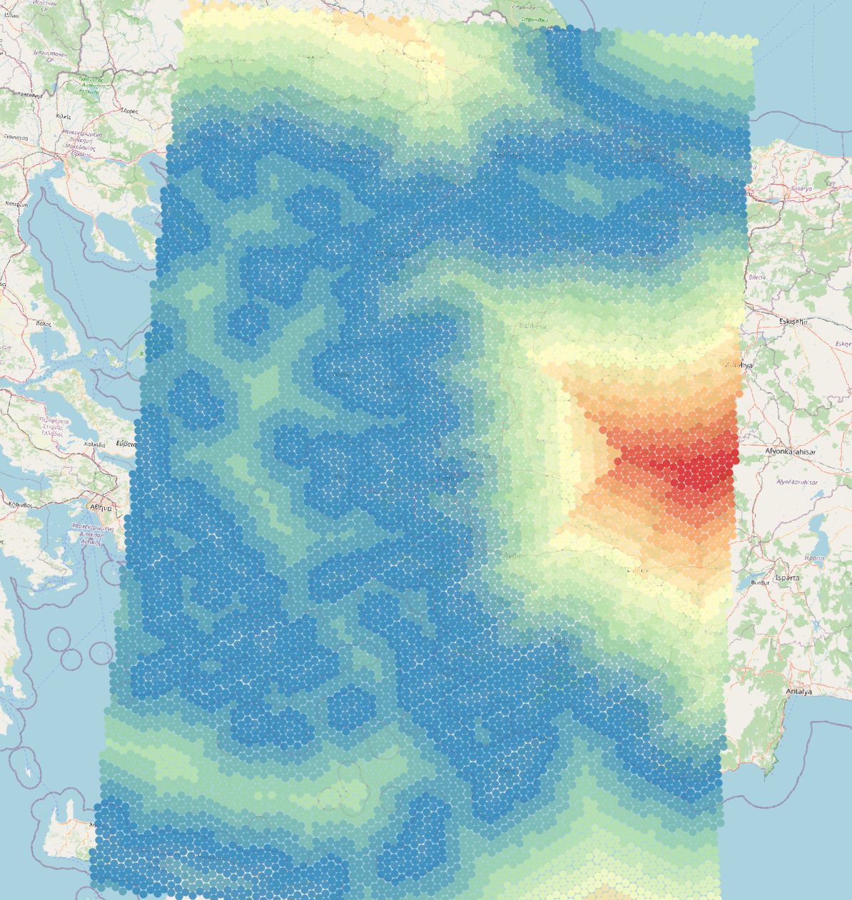

# datasette example that computes distance to coastline

Based on SImon Willison's post; 
[Building a location to time zone API with SpatiaLite, OpenStreetMap and Datasette](https://simonwillison.net/2017/Dec/12/location-time-zone-api/)

## Instructions
1. start docker `docker-compuse up`
2. open browser at http://0.0.0.0:8001/ne/nearest_coast?longitude=-4.7&latitude=50

you should see something like

![images/screenshot.png]

Demo showing values mapped over the Aegean Sea

Live Demo
https://datasette-coast-production.up.railway.app/ne/nearest_coast?longitude=-5&latitude=51
