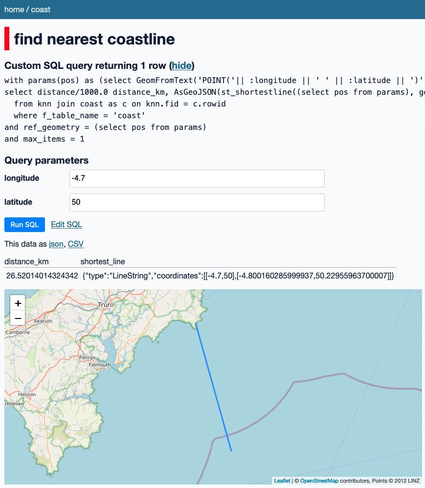

# datasette example that computes distance to coastline

## Instructions

0. create database (has issues...)
```shell
mkdir -p temp
cd temp && curl -LO https://www.naturalearthdata.com/http//www.naturalearthdata.com/download/110m/physical/ne_110m_coastline.zip
# or
cd temp && curl -LO https://www.naturalearthdata.com/http//www.naturalearthdata.com/download/10m/physical/ne_10m_coastline.zip
unzip ne_110m_coastline.zip && cd ..

spatialite dataset/coast.db
.loadshp ne_110m_coastline/ne_110m_coastline coast utf-8
.quit
```
1. start docker `. ./run-datasette`
2. open browser at http://0.0.0.0:8001/coast/nearest_coast?longitude=-4.7&latitude=50

you should see something like

![images/screenshot.png]
